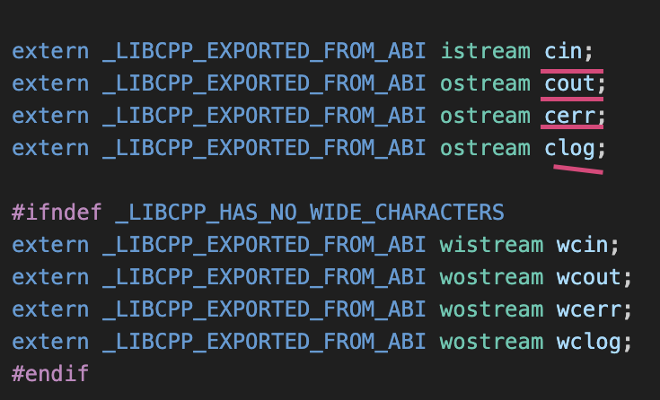
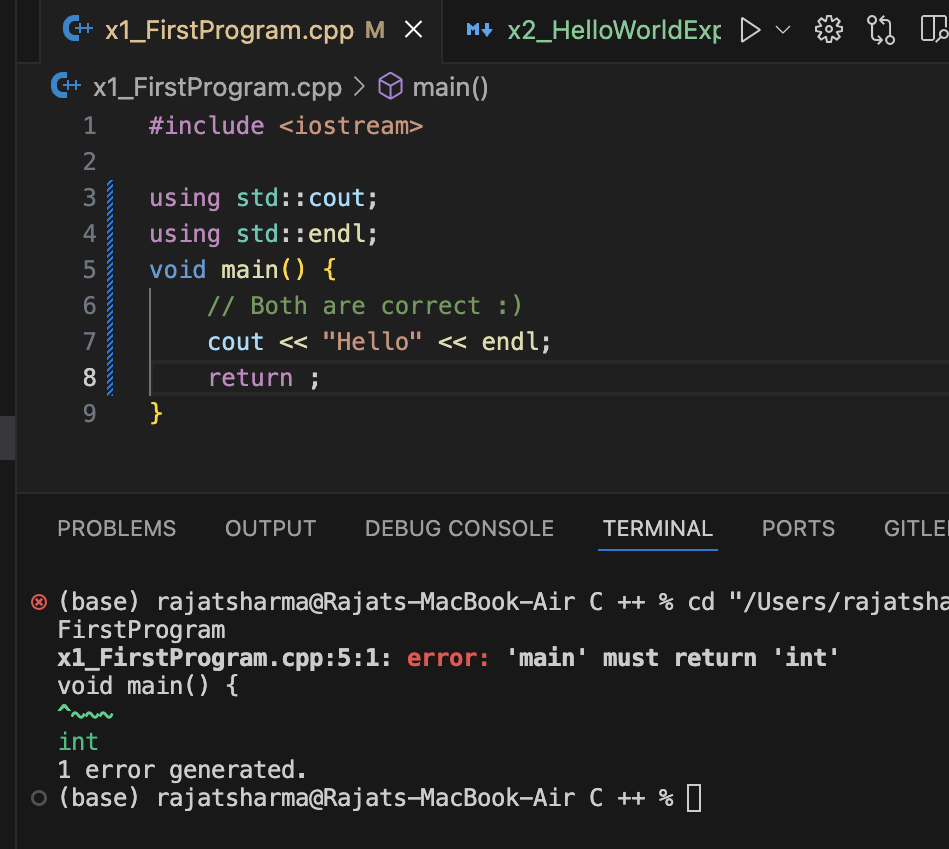
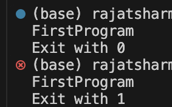

### Preprocessor directive

```cpp
#include <iostream>

using namespace std;

int main() {
    cout << "Hello, Rajat!" << endl;
    // std::cout << "Hello"; // Commented out
    return 0;
}
```

#### Inside the iostream library



- `#include <iostream>`: This is a preprocessor directive that includes the Input-Output Stream library in C++.
- `using namespace std;`: This allows us to use standard C++ functions without prefixing `std::`.
- `cout << "Hello, Rajat!" << endl;`: Prints the message to the console and `endl` moves the cursor to the next line.

---

### Namespaces in C++

A **namespace** is a way to organize code and prevent naming conflicts. It acts as a container for identifiers (variables, functions, classes, etc.).

#### Benefits of Namespaces:

- **Avoid Naming Collisions:** The same identifier can exist in different namespaces without conflict.
- **Organize Code:** Helps structure code into logical groups.
- **Encapsulation:** Prevents unintended access to identifiers from outside the namespace.

#### Example of a Namespace:

```cpp
#include <iostream>

using namespace std;

namespace rajat {
    void display() {
        cout << "Yo, Rajat!" << endl;
    }
}

int main() {
    rajat::display(); // Calling function inside namespace
    return 0;
}
```

---

### Popular C++ Namespace Libraries:

- `std` - Standard C++ Library
- `qt` - GUI Development
- `eigen` - Mathematics (almost like a framework)
- `gtest` - Google Test Framework (similar to JUnit in Java)

---

### Alternative Ways to Use `std` Without `using namespace std;`

Instead of importing the entire namespace, we can specify only what we need:

```cpp
#include <iostream>

int main() {
    // Both are correct :)
    std::cout << "Hello" << std::endl;
    std::cout << "Hello";
    return 0;
}
```

```cpp
#include <iostream>

using std::cout;
using std::endl;
int main() {
    // Both are correct :)
    cout << "Hello" << endl;
    return 0;
}
```

## Understanding Exit Codes and `main()` in C++

In C++, the **`main()`** function must return a value, usually an **exit code** that tells the operating system whether the program ran successfully or had an error.

### Why Not Use `void main()`?

In C++, we are working with a **statically typed** language, so we need to specify the return type of functions. The `main()` function must return an integer (`int`), not `void`.

- **`void main()`** means the program is not returning anything, and the operating system won’t know if the program finished correctly. While some compilers may allow `void main()`, **it is not standard** in C++ and should be avoided.



### What Are Exit Codes?

Exit codes are returned from the `main()` function to indicate how the program ended.

- **`0`**: Indicates the program finished successfully.
- **Non-zero values** (e.g., `1`, `2`) indicate an error or a specific condition.

### Why Use `int main()`?

- The `main()` function must return an `int` because the operating system expects it to return a value.
- **`int main()`** returns an **exit code**, typically `0` for success. This tells the operating system that everything went well.

### Example:

```cpp
#include <iostream>

int main() {  // 'int' is required
    std::cout << "Hello, Rajat!" << std::endl;
    return 1;  // Return 1 indicates failure :P
}
```


